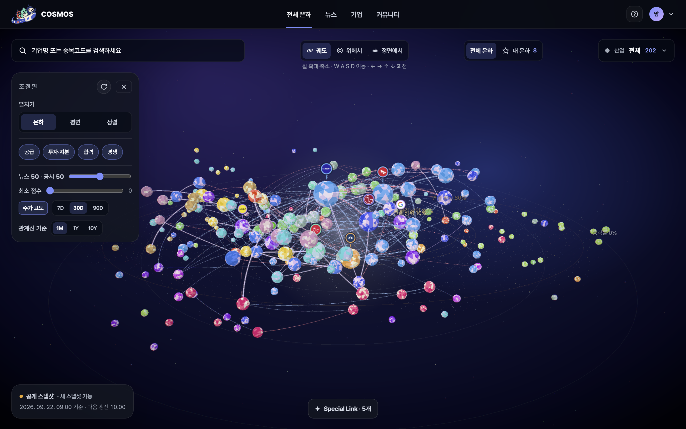
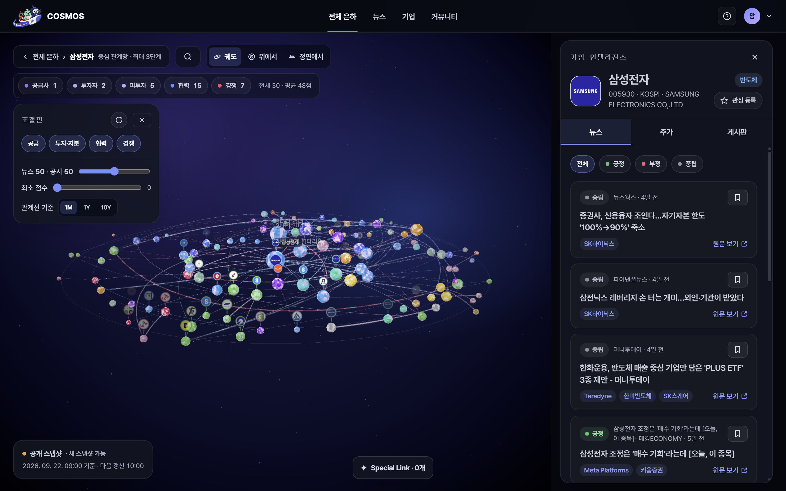
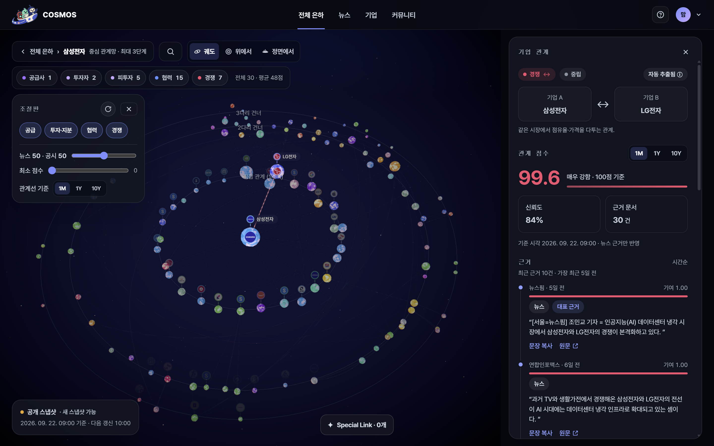
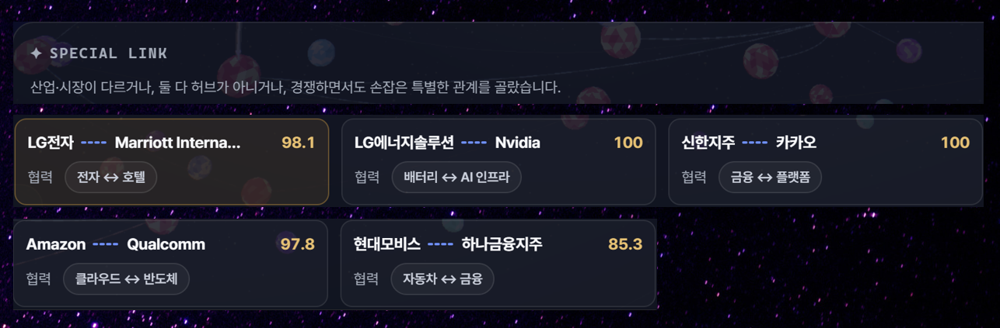
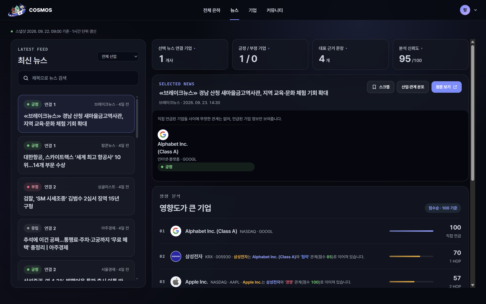
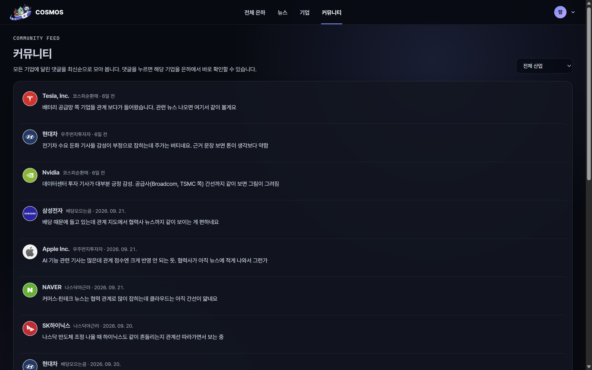
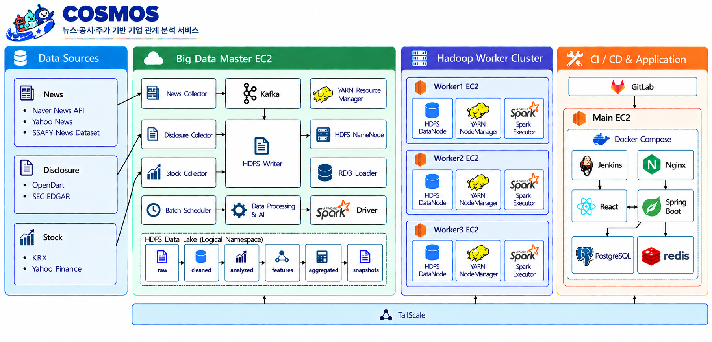

<div align="center">
  

  <p><b>빅데이터와 AI 기반의 기업 관계 시각화 서비스</b><br>
  <i>흩어진 기업 정보를 연결해, 보이지 않던 관계를 한눈에</i></p>

  <p>
    
    
    
  </p>

  <p>
    
    
    
    
    
    
    
    
  </p>
</div>

---

## 목차

1. [서비스 소개](#1-서비스-소개)
2. [핵심 기능](#2-핵심-기능)
3. [시스템 아키텍처](#3-시스템-아키텍처)
4. [기술 스택](#4-기술-스택)
5. [기술적 특장점](#5-기술적-특장점)
6. [기대 효과](#6-기대-효과)
7. [산출물](#7-산출물)
8. [시작하기](#8-시작하기)
9. [프로젝트 구조](#9-프로젝트-구조)
10. [문서 인덱스](#10-문서-인덱스)
11. [팀 소개](#11-팀-소개)

---

## 1. 서비스 소개

**COSMOS는 뉴스·공시·주가 빅데이터를 AI로 분석하여 기업 간 관계를 3D 은하 형태로 시각화하는 서비스입니다.**
기업은 행성으로, 기업 간 협력·경쟁·공급·투자 관계는 연결선으로 표현됩니다.

투자자나 기업 조사자는 여러 뉴스와 공시를 직접 읽고 관계를 조합해야 합니다. 이 과정에서는 서로 다른 산업에 속한 기업의 연결이나 관계 변화의 배경을 놓치기 쉽습니다. COSMOS는 분산된 원문을 수집·정규화하고, 기업 식별과 관계 분석을 거쳐 **전체 관계 탐색 → 관심 산업 필터링 → 특정 기업 확인 → 근거 뉴스 검토**로 이어지는 경험을 제공합니다.

<table>
<tr>
<th width="160">단계</th>
<th width="340">역할</th>
<th>대표 기능</th>
</tr>
<tr>
<td><b>① 데이터 수집</b></td>
<td>뉴스·공시·주가 데이터를 지속적으로 수집하고 원본 보존</td>
<td>Kafka 이벤트 전달 · HDFS 데이터 레이크 · 실패 데이터 격리</td>
</tr>
<tr>
<td><b>② AI 관계 분석</b></td>
<td>문서에서 기업을 식별하고 관계 유형·감성·영향·근거를 추출</td>
<td>기업명 정규화 · 관계 분류 · FinBERT 감성 분석 · 근거 문장 추출</td>
</tr>
<tr>
<td><b>③ 관계 집계</b></td>
<td>분산 처리로 기간별 기업 지표와 관계 점수를 계산</td>
<td>Spark/YARN 집계 · 30일·1년·10년 관계 스냅샷</td>
</tr>
<tr>
<td><b>④ 서비스 탐색</b></td>
<td>게시가 완료된 결과를 3D 그래프와 상세 화면으로 제공</td>
<td>전체 은하 · 기업 중심 그래프 · 관계 근거 · 뉴스 · 주가 · 커뮤니티</td>
</tr>
</table>

| 사용자 | 주요 목적 | 활용 기능 |
|---|---|---|
| **투자 참고 정보를 찾는 사용자** | 기업 관계와 관련 사건을 함께 검토 | 기업 검색 · 관계 점수 · 근거 뉴스 · 주가 차트 |
| **산업 구조를 조사하는 사용자** | 특정 산업의 기업 생태계 파악 | 전체 은하 · 산업군 필터 · 기업 중심 그래프 |
| **기업을 조사하는 사용자** | 예상하기 어려운 연결과 관계 배경 탐색 | 특별한 관계 · 관계 유형 · 관계 근거 |

> COSMOS가 제공하는 관계 점수와 뉴스는 투자 참고 정보이며, 특정 종목의 매수·매도를 추천하거나 수익을 보장하지 않습니다.

---

## 2. 핵심 기능

### 전체 은하 — 기업 생태계를 한눈에



코스피·나스닥 주요 기업을 행성으로 배치하고 기업 간 관계를 연결선으로 표현합니다. 화면 회전, 확대·축소, 기업 검색과 산업군 필터를 통해 복잡한 관계망에서 관심 영역으로 탐색 범위를 좁힐 수 있습니다.

| 조절 항목 | 설명 |
|---|---|
| **뉴스·공시 가중치** | 두 데이터가 화면의 관계 점수에 반영되는 비율을 조절 |
| **최소 점수** | 기준 이상의 관계만 남겨 강한 연결에 집중 |
| **주가 고도** | 선택 기간의 주가 등락률을 행성의 높이로 표현 |
| **관계선 기준** | 1개월(30D)·1년(1Y)·10년(10Y) 단위의 관계 결과 비교 |
| **산업군 필터** | 선택한 산업에 속하는 기업을 중심으로 그래프 탐색 |

### 기업 중심 탐색 — 연결 기업과 경로 확인



기업명 또는 종목코드로 원하는 기업을 찾고 해당 기업을 중심으로 연결된 기업을 탐색합니다. 기업 기본 정보, 산업, 관련 뉴스, 주가와 커뮤니티를 하나의 상세 패널에서 확인할 수 있습니다.

### 관계 상세 — 점수에서 근거 문서까지



관계선을 선택하면 두 기업의 관계 유형, 관계 점수, 신뢰도, 영향 방향과 근거 문서 수를 제공합니다. 근거 뉴스와 문장을 함께 연결하여 사용자가 분석 결과의 배경을 직접 확인할 수 있도록 했습니다.

| 정보 | 내용 |
|---|---|
| **관계 유형** | 협력 · 경쟁 · 공급 · 투자(지분 포함) |
| **관계 점수** | 뉴스·공시 분석 결과를 바탕으로 계산한 관계 강도 |
| **분석 신뢰도** | 관계 분석 결과의 신뢰 수준 |
| **근거 데이터** | 관계 판단에 사용된 뉴스, 근거 문장과 원문 링크 |

### 특별한 관계 — 예상 밖의 연결 발견



기업명이나 산업 분류만으로는 쉽게 떠올리기 어려운 관계를 선별해 보여줍니다. 사용자는 추천된 기업 쌍에서 출발해 그래프와 근거 문서를 따라가며 새로운 기업 연결을 탐색할 수 있습니다.

### 뉴스 — 기업과 관계를 함께 읽는 뉴스 탐색



최신 뉴스를 검색하고 산업·감성 조건으로 필터링합니다. 뉴스 상세에서는 관련 기업과 분석 결과를 확인할 수 있으며, 원문 링크를 통해 기사 전체 내용을 검토할 수 있습니다.

### 관심 기업과 커뮤니티



로그인 사용자는 관심 기업을 저장하고 뉴스 스크랩을 관리할 수 있습니다. 각 기업의 상세 화면에서는 해당 기업에 관한 의견을 댓글로 나누고, 커뮤니티 화면에서 전체 기업의 최신 대화를 확인할 수 있습니다.

---

## 3. 시스템 아키텍처



COSMOS는 **수집 계층**, **분산 데이터·AI 계층**, **서비스 계층**으로 구성됩니다. 대용량 원본과 중간 결과는 HDFS에 보존하고, 웹 서비스에서 자주 조회하는 게시 결과만 PostgreSQL에 적재하여 저장과 조회의 책임을 분리했습니다.

```text
뉴스 수집 ──→ Outbox ──→ Kafka ──→ HDFS Raw
공시 수집 ─────────────────────────→ HDFS Raw
주가 수집 ─────────────────────────→ HDFS Raw
                                          │
                               정제·기업 식별·AI 분석
                                          │
                              Spark/YARN 기간별 집계
                                          │
                       검증된 스냅샷 → PostgreSQL 게시
                                          │
                    Spring Boot REST API → React 3D Web
```

### 배포 구성

웹 서비스와 데이터 처리 클러스터를 분리해 배포합니다.

| 서버 | 역할 |
|---|---|
| **SSAFY 웹 EC2** | 호스트 Nginx · React 정적 웹 · Spring Boot · PostgreSQL · Redis · Jenkins |
| **SSAFY 데이터 Master EC2** | HDFS NameNode · YARN ResourceManager · Spark Driver · Kafka · 수집기 · 분석기 · RDB Loader |
| **AWS Worker 1~3** | HDFS DataNode · YARN NodeManager · Spark Executor |

서버 간 데이터 트래픽은 Tailscale 사설망으로 연결하며, 외부에는 SSH와 HTTP/HTTPS 포트만 공개합니다. 웹 배포와 데이터 파이프라인 실행을 분리하여 애플리케이션 배포가 Hadoop·Kafka 작업에 영향을 주지 않도록 구성했습니다.

### 데이터 레이크 구조

```text
/data-lake
├── raw/          수집한 뉴스·공시·주가 원본
├── cleaned/      형식 통일·중복 제거·정규화 결과
├── analyzed/     기업 언급·관계·감성·근거 분석 결과
├── features/     관계 점수 계산용 중간 특징값
├── aggregated/   기간별 기업 지표와 관계 점수
├── snapshots/    서비스 게시용 그래프 스냅샷
└── quarantine/   스키마·수집·분석 실패 데이터
```

---

## 4. 기술 스택

### Frontend — 3D 관계 탐색 웹

| 구분 | 기술 | 버전 |
|---|---|---|
| 런타임 | Node.js | 24 (지원 범위 `>=20`) |
| UI | React / TypeScript | 19.2 / 5.9 |
| 빌드 | Vite | 8 |
| 3D | Three.js / React Three Fiber / Drei | 0.185 / 9.7 / 10.7 |
| 상태·서버 데이터 | Zustand / TanStack Query | 5 / 5 |
| 라우팅 | React Router | 7 |

### Backend — Spring Boot API

| 구분 | 기술 | 버전 |
|---|---|---|
| 프레임워크 | Spring Boot (내장 Tomcat) | 4.1.1 |
| 언어 / 빌드 | Java (Temurin) / Gradle Wrapper | 21 / 9.7.1 |
| 영속성 | Spring Data JPA · JDBC · Flyway | Spring Boot BOM / V1~V9 |
| 인증 | Spring Security · JWT · Redis Refresh Token | jjwt 0.12.6 |
| 데이터베이스 | PostgreSQL | 17.11 |

### Data / AI

| 구분 | 기술 | 버전·역할 |
|---|---|---|
| 분산 저장 | Apache Hadoop HDFS | 3.5.0 · 원본과 분석 결과 장기 보관 |
| 분산 처리 | Apache Spark / YARN | 4.2.0 · 기간별 지표와 관계 점수 집계 |
| 메시지 큐 | Apache Kafka | 4.3.1 · 뉴스 수집 이벤트 전달과 완충 |
| 분석 런타임 | Python | 3.12 · 정제, 기업 식별, 관계·감성 분석 |
| 감성 분석 | FinBERT (`ProsusAI/finbert`) | 금융 뉴스 감성 분석 |
| 기업 식별 | 사전 매칭 + NER | 기업명·영문명·약칭을 기준 기업 ID로 정규화 |
| 서비스 적재 | Python RDB Loader | 검증된 HDFS 스냅샷을 PostgreSQL에 게시 |

### Infra / DevOps

| 구분 | 기술 | 버전 |
|---|---|---|
| 서버 | SSAFY EC2 · AWS EC2/EBS (Ubuntu) | 24.04.4 LTS |
| 컨테이너 | Docker Engine / Docker Compose | 29.8.0 / 5.5.1 |
| 웹서버 | Nginx | 1.24.0 (호스트) / stable-alpine (컨테이너) |
| 캐시 | Redis | 7.4.11 |
| CI/CD | Jenkins | 2.568.3, JDK 21 |
| 인증서 | Let's Encrypt / Certbot | 2.9.0 |
| 사설망 | Tailscale | 1.102.4 |

### 협업

| 구분 | 도구 |
|---|---|
| 형상 관리 | GitLab (SSAFY) |
| 이슈·일정 | Jira |
| 문서 | Notion · Markdown |
| 디자인 | Figma |
| 커뮤니케이션 | Mattermost |

---

## 5. 기술적 특장점

### 원본 보존과 서비스 조회의 분리

뉴스·공시·주가 원본과 정제·분석·집계 데이터는 HDFS에 단계별로 보존합니다. 모델이나 계산식이 변경되면 원본에서 다시 처리할 수 있고, Spring Boot는 요청 중 HDFS나 Spark를 직접 호출하지 않고 PostgreSQL의 게시 결과만 조회합니다.

| 저장소 | 책임 |
|---|---|
| **HDFS** | 대용량 원본·중간 결과·분석 결과 보존, 재분석과 재현 |
| **PostgreSQL** | 기업·뉴스·관계·주가·사용자 등 서비스 조회와 트랜잭션 |
| **Redis** | Refresh Token과 이메일 인증 코드 등 만료 데이터 |
| **Kafka** | 뉴스 수집과 저장 단계 분리, 장애 시 완충과 재처리 |

### 5대 서버 기반 분산 저장·처리

Hadoop Master와 AWS Worker 3대를 HDFS·YARN 클러스터로 구성했습니다. HDFS 복제 계수 2로 데이터를 분산 보관하고, Spark 작업을 여러 NodeManager에 배치하여 대규모 집계를 병렬 처리할 수 있도록 했습니다. 웹 EC2는 서비스 제공에 집중하여 데이터 처리 부하와 분리했습니다.

### 설명 가능한 기업 관계

관계 점수만 제공하면 사용자가 결과를 검증하기 어렵습니다. COSMOS는 관계 결과에 원본 문서 ID, 근거 문장, 관계 유형, 방향, 분석 신뢰도와 모델·계산식 버전을 연결합니다. 사용자는 그래프의 관계선에서 근거 뉴스 원문까지 단계적으로 추적할 수 있습니다.

### 검증된 스냅샷만 게시하는 적재 구조

분석 결과를 바로 현재 서비스 데이터로 덮어쓰지 않습니다. HDFS 산출물의 파일 목록·행 수·체크섬과 완료 상태를 확인한 뒤 Loader가 PostgreSQL staging에 적재하고, 검증을 통과한 결과만 게시합니다. 동일 스냅샷의 재실행에도 중복이 생기지 않도록 실행 ID와 게시 이력을 관리합니다.

### 사용자 관점에 따른 관계 탐색

전체 그래프는 공통 스냅샷을 사용하면서도 뉴스·공시 구성 점수를 함께 제공합니다. 사용자는 브라우저에서 가중치를 조절해 관계 표현을 즉시 비교할 수 있으며, 최소 점수·산업군·기간을 조합해 같은 데이터에서 서로 다른 관점의 기업 생태계를 탐색할 수 있습니다.

### 3D 그래프의 탐색성과 서비스 성능 분리

React Three Fiber 기반의 3D 그래프는 검색·필터·기업 중심 탐색으로 표시 범위를 조절합니다. API는 최신 정상 게시 스냅샷을 기준으로 일관된 노드와 간선을 반환하고, 목록 조회에는 커서 기반 페이지네이션과 조회 인덱스를 적용하여 그래프 렌더링과 데이터 조회의 책임을 분리했습니다.

---

## 6. 기대 효과

**기업 관계 탐색 시간 단축.** 여러 뉴스와 공시를 개별적으로 검색하는 대신 전체 관계망에서 관심 기업과 연결 기업을 빠르게 찾을 수 있습니다.

**숨은 연결 발견.** 서로 다른 산업에 속해 표면적으로 연관성이 낮아 보이는 기업도 실제 뉴스와 공시에서 확인된 연결을 통해 새로운 조사 대상으로 발견할 수 있습니다.

**근거 기반 판단.** 관계 점수만 제시하지 않고 근거 뉴스와 문장을 함께 제공하여 사용자가 분석 결과를 직접 검토하고 자신의 판단에 활용할 수 있습니다.

**관점에 따른 비교.** 뉴스·공시 가중치, 관계 점수 기준과 분석 기간을 조절해 단일 순위가 아닌 다양한 관점에서 기업 관계를 비교할 수 있습니다.

**확장 가능한 데이터 자산.** HDFS에 축적한 원본과 버전별 분석 결과를 이용해 관계 모델을 개선하거나 새로운 기업과 데이터 출처를 추가해도 기존 데이터를 다시 활용할 수 있습니다.

---

## 7. 산출물

| 산출물 | 위치 |
|---|---|
| **DB 덤프** | [exec/DB_DUMP.md](exec/DB_DUMP.md) · `exec/db/cosmos_web.dump.part-*` |
| **DB 스키마·마이그레이션** | `BackEnd/src/main/resources/db/migration/V1~V9__*.sql` (Flyway) |
| **API 명세** | [docs/api-specification.md](docs/api-specification.md) |
| **데이터베이스 설계** | [docs/database-design.md](docs/database-design.md) |
| **서비스 아키텍처** | [docs/architecture.md](docs/architecture.md) |
| **분산 인프라 설계** | [docs/infrastructure-design.md](docs/infrastructure-design.md) |
| **포팅 매뉴얼** | [exec/PORTING_MANUAL.md](exec/PORTING_MANUAL.md) |
| **외부 서비스 정보** | [exec/EXTERNAL_SERVICES.md](exec/EXTERNAL_SERVICES.md) |
| **시연 시나리오** | [exec/DEMO_SCENARIO.md](exec/DEMO_SCENARIO.md) |

### 주요 서비스 도메인

| 도메인 | 책임 |
|---|---|
| `auth` / `user` | 이메일 인증 · 회원가입 · JWT 인증 · 프로필 · 관심 기업 · 뉴스 스크랩 |
| `company` | 기업 검색 · 상세 · 지표 · 주가 조회 |
| `graph` | 전체/기업 중심 관계 그래프 · 관계 상세 · 근거 뉴스 |
| `news` | 뉴스 검색·필터 · 상세 · 관련 기업 |
| `community` | 전체 최신 댓글 · 기업별 댓글 · 작성·수정·삭제 |
| `global` | 보안 · 시간 · 공통 응답 · 예외 처리 |

---

## 8. 시작하기

> 전체 빌드·배포 절차는 [**exec/PORTING_MANUAL.md**](exec/PORTING_MANUAL.md), 외부 서비스 키 발급과 설정은 [**exec/EXTERNAL_SERVICES.md**](exec/EXTERNAL_SERVICES.md)에 있습니다. 아래는 로컬 개발 환경의 최소 실행 절차입니다.

### 사전 준비

- JDK 21
- Node.js 20 이상
- Docker Desktop 또는 Docker Engine + Compose

`.env`는 Git에 커밋하지 않습니다. `BackEnd/.env.example`, `FrontEnd/.env.example`을 복사한 뒤 필요한 값을 입력합니다.

### ① PostgreSQL · Redis

```bash
docker compose -f BackEnd/docker-compose.yml up -d
```

시연 데이터가 필요하면 [DB 덤프 복원 안내](exec/DB_DUMP.md)에 따라 분할 파일을 합치고 빈 데이터베이스에 복원합니다.

### ② Spring Boot

```bash
cd BackEnd
cp .env.example .env
SERVER_PORT=18081 ./gradlew bootRun
```

Windows PowerShell에서는 환경변수를 설정한 뒤 Wrapper를 실행합니다.

```powershell
cd BackEnd
Copy-Item .env.example .env
$env:SERVER_PORT = "18081"
.\gradlew.bat bootRun
```

애플리케이션 시작 시 Flyway가 PostgreSQL 스키마를 V9까지 검증·적용합니다.

### ③ React 웹

```bash
cd FrontEnd
cp .env.example .env
npm ci
npm run dev
```

개발 서버는 기본적으로 `http://localhost:5173`에서 실행되고 `/api` 요청을 Spring Boot로 프록시합니다.

### 상태 확인

```bash
curl http://localhost:18081/actuator/health
```

---

## 9. 프로젝트 구조

```text
S15P21C205/
├── FrontEnd/                    React + TypeScript 3D 웹
│   ├── public/                  기업 로고 · 정적 리소스
│   └── src/
│       ├── features/            auth · company · galaxy · news · community · profile
│       ├── components/          공통 UI 컴포넌트
│       ├── lib/                 API · 그래프 · 유틸리티
│       └── store/               클라이언트 상태
│
├── BackEnd/                     Spring Boot 4 API 서버
│   └── src/main/
│       ├── java/com/cosmos/api/
│       │   ├── company/         기업·지표·주가
│       │   ├── graph/           관계 그래프·상세·근거
│       │   ├── news/            뉴스 검색·상세
│       │   ├── community/       기업 커뮤니티
│       │   ├── user/            인증·프로필·관심·스크랩
│       │   └── global/          보안·설정·예외·공통 응답
│       └── resources/db/migration/   Flyway V1~V9
│
├── Crawling/                    원천 데이터 수집
│   ├── news/                    국내외 뉴스 수집·Kafka 발행
│   ├── disclosures/             OpenDART · SEC 공시 수집
│   ├── prices/                  코스피·나스닥 일봉 수집
│   └── documents/               문서 게시·적재
│
├── AI/                          데이터 분석·서비스 적재
│   ├── ner/                     기업명 추출·정규화
│   ├── gpu_news/                FinBERT 감성 분석
│   ├── graph/                   관계·영향도·근거·GNN 분석
│   └── rdb_loader/              검증된 결과의 PostgreSQL 게시
│
├── deploy/                      CI/CD · Nginx · Hadoop · 파이프라인 배포
├── docs/                        요구사항 · API · DB · 아키텍처 문서
├── exec/                        포팅 매뉴얼 · 외부 서비스 · DB 덤프 · 시연 시나리오
├── galaxy_web/                  초기 3D 그래프 프로토타입
└── Jenkinsfile                  웹 서비스 CI/CD 파이프라인
```

---

## 10. 문서 인덱스

| 문서 | 내용 |
|---|---|
| [exec/README.md](exec/README.md) | 최종 제출·인계 자료 안내 |
| [exec/PORTING_MANUAL.md](exec/PORTING_MANUAL.md) | 제품 버전 · 환경변수 · 빌드·배포 · DB 접속 설정 |
| [exec/EXTERNAL_SERVICES.md](exec/EXTERNAL_SERVICES.md) | 외부 서비스 가입·키 발급·설정 위치 |
| [exec/DB_DUMP.md](exec/DB_DUMP.md) | 비식별화된 DB 덤프 구성과 복원 방법 |
| [exec/DEMO_SCENARIO.md](exec/DEMO_SCENARIO.md) | 발표 시연 순서와 점검 항목 |
| [docs/requirements-specification.md](docs/requirements-specification.md) | 서비스 기능·비기능 요구사항 |
| [docs/api-specification.md](docs/api-specification.md) | REST API 요청·응답·오류 명세 |
| [docs/database-design.md](docs/database-design.md) | PostgreSQL ERD와 HDFS 데이터 모델 |
| [docs/architecture.md](docs/architecture.md) | 전체 서비스 계층과 데이터 흐름 |
| [docs/infrastructure-design.md](docs/infrastructure-design.md) | 분산 데이터 인프라와 데이터 레이크 설계 |
| [docs/HADOOP_CLUSTER.md](docs/HADOOP_CLUSTER.md) | Hadoop·YARN 클러스터 구성과 운영 |
| [docs/CICD.md](docs/CICD.md) | Jenkins 기반 웹 빌드·배포·롤백 |
| [docs/rdb-loader.md](docs/rdb-loader.md) | HDFS 집계 결과의 PostgreSQL 게시 절차 |
| [docs/TEAM_CONVENTION.md](docs/TEAM_CONVENTION.md) | 브랜치·커밋·MR 협업 규칙 |

---

## 11. 팀 소개


| 송현민 | 박준우 | 조석원 | 오양호 | 김기현 | 송호영 |
|:---:|:---:|:---:|:---:|:---:|:---:|
| Data · Infra | AI | Backend · Infra | Backend | Data · Frontend | Frontend |

**개발 기간** — 2026.08 ~ 2026.09 · 삼성 청년 SW·AI 아카데미 15기 특화 프로젝트

---

<div align="center">
  <sub>SSAFY 15기 · 광주 2반 · C205 <b>COSMOS</b></sub>
</div>
