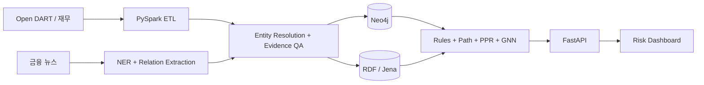

# Architecture & Modeling Notes

## 1. End-to-end flow



원본 관측 관계와 추론 관계는 분리합니다. 모든 엣지는 `evidence`, `confidence`, `observedAt`, `pipelineVersion`을 가져야 하며, 추론 엣지는 추가로 `rule`과 `inferred=true`를 저장합니다.

## 2. Canonical graph model

| Entity | Key | 주요 속성 |
|---|---|---|
| Company | 법인등록번호 또는 내부 canonical ID | ticker, marketCapKRW, rating, PER, PBR |
| Shareholder | LEI/기관 ID 또는 entity-resolution ID | name, country, investorType |
| Industry | WICS/KSIC 코드 | code, name, theme |
| Material | HS 코드 + 정규화 명칭 | hsCode, name, unit |
| Event | source + publishedAt + contentHash | type, severity, confidence |

관계 방향은 원천 데이터의 의미를 보존합니다. `Company-[:USES_MATERIAL]->Material`이 canonical 방향이며, 충격 전이 계산에서는 이 관계를 reverse projection합니다. 뉴스가 특정 원자재 차질과 기업 노출을 직접 연결하면 `Material-[:SHORTAGE_RISK]->Company`를 별도 관측 관계로 적재합니다.

## 3. Edge weight

가중치 `w ∈ [0, 1]`는 관계별로 다르게 정의합니다.

- `SUPPLIES_TO`: 매출 의존도, 고객 집중도, 대체가능성의 결합
- `OWNS_STAKE`: 지분율, 의결권 배수, 실질 지배력의 결합
- `USES_MATERIAL`: 원재료 원가 비중과 재고 커버리지의 결합
- `SHORTAGE_RISK`: 이벤트 심각도 × 추출 신뢰도 × 기업 노출도

데이터가 누락된 경우 0으로 확정하지 않고 `null`과 confidence를 함께 유지합니다. 분석 단계에서는 산업별 사전분포 또는 보수적 하한을 명시적으로 선택합니다.

## 4. Entity resolution

1. 법인등록번호·종목코드·DART corp_code exact match
2. 정규화 상호명 + 주소 + 대표자 weighted match
3. 뉴스 약칭 dictionary 및 계열사 alias
4. 임계치 미만 후보는 `requiresReview=true`로 격리

같은 이름의 다른 법인을 합치는 오류가 전이 분석에서 가장 치명적이므로 precision을 recall보다 우선합니다.

## 5. Reasoning

### Majority control

```text
OWNS_STAKE(stakeRatio > 0.50) → CONTROLLING_ENTITY
```

단순 지분율 외에 의결권 제한, 상호출자, 우호지분을 추가하면 실질 지배력 모델로 확장할 수 있습니다.

### Exclusive supplier

```text
SUPPLIES_TO(revenueShare ≥ 0.60 ∧ substitutability ≤ 0.20)
→ EXCLUSIVE_SUPPLIER
```

### Propagation

데모 엔진은 최대 경로 기반 확산을 사용해 점수 설명 가능성을 높였습니다. 운영 모델은 확률적 cascade, inventory buffer, alternative supplier, recovery time을 상태 변수로 추가할 수 있습니다.

## 6. GNN roadmap

- Node feature: 재무비율, 신용등급 embedding, 주가 변동성, 재고일수, 뉴스 sentiment
- Edge feature: 관계 유형, 의존도, confidence, age, 계약 만기
- Target: 30/90일 부실·등급하락·공급중단 이벤트
- Model: R-GCN 또는 Heterogeneous Graph Transformer
- Validation: 시간순 split, 산업 hold-out, negative-edge sampling leakage 방지
- Explainability: attention만으로 설명하지 않고 path attribution과 counterfactual edge removal 병행

## 7. Production controls

- API key와 DB credential은 환경변수/secret manager로 주입
- 원문 뉴스 저작권 범위를 넘는 저장을 피하고 evidence에는 짧은 문장·URL·hash 보관
- 공시 정정 발생 시 bitemporal versioning으로 과거 분석 재현
- 모델/규칙/데이터 snapshot ID를 분석 결과에 기록
- 투자 판단용으로 제공할 경우 human review, 감사 로그, 모델 리스크 관리 절차 추가
