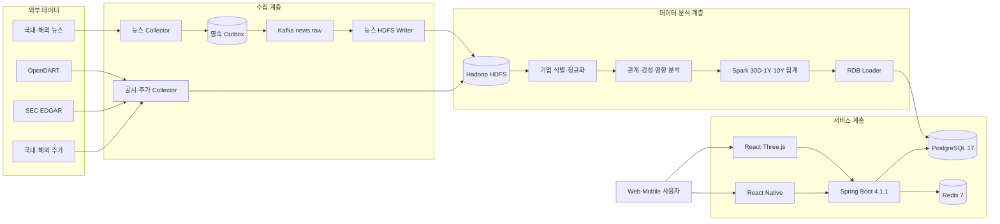

# COSMOS 서비스 아키텍처

## 1. 문서 목적

이 문서는 COSMOS의 현재 서비스 구조와 데이터 처리 흐름을 설명한다. 물리 서버, 네트워크와 용량은 [인프라 설계서](./infrastructure-design.md), 데이터 구조는 [데이터베이스 설계서](./database-design.md), 외부 계약은 [API 명세서](./api-specification.md)를 기준으로 한다.

COSMOS는 뉴스·공시·주가 원본을 HDFS에 보존하고 분석·집계 결과만 PostgreSQL에 게시한다. 웹 요청 처리와 대규모 데이터 처리를 분리하여 Spring Boot가 사용자 요청 중 HDFS를 직접 조회하거나 Spark 작업을 실행하지 않도록 한다.

## 2. 전체 구조


```mermaid
flowchart LR
    User[Web·Mobile 사용자]

    subgraph Sources[외부 데이터]
        News[국내·해외 뉴스]
        DART[OpenDART]
        SEC[SEC EDGAR]
        Price[국내·해외 주가]
    end

    subgraph Ingestion[수집 계층]
        NewsCollector[뉴스 Collector]
        Outbox[(영속 Outbox)]
        Kafka[Kafka news.raw]
        NewsWriter[뉴스 HDFS Writer]
        BatchCollector[공시·주가 Collector]
    end

    subgraph DataLake[데이터·분석 계층]
        HDFS[(Hadoop HDFS)]
        Entity[기업 식별·정규화]
        Relation[관계·감성·영향 분석]
        Spark[Spark 30D·1Y·10Y 집계]
        Loader[RDB Loader]
    end

    subgraph Service[서비스 계층]
        PG[(PostgreSQL 17)]
        Redis[(Redis 7)]
        API[Spring Boot 4.1.1]
        Web[React·Three.js]
        Mobile[React Native]
    end

    News --> NewsCollector --> Outbox --> Kafka --> NewsWriter --> HDFS
    DART --> BatchCollector
    SEC --> BatchCollector
    Price --> BatchCollector
    BatchCollector --> HDFS
    HDFS --> Entity --> Relation --> Spark --> Loader --> PG
    User --> Web --> API
    User --> Mobile --> API
    API --> PG
    API --> Redis
```

React Native 모바일 애플리케이션과 별도 FastAPI 추론 서비스는 확장 구성이다. 현재 사용자용 공개 API의 기준은 Spring Boot다.

## 3. 계층별 책임

### 3.1 수집 계층

- 뉴스 Collector는 수집 결과를 영속 Outbox에 먼저 기록한 뒤 Kafka `news.raw`로 발행한다.
- 뉴스 HDFS Writer는 Consumer Group으로 메시지를 읽고 HDFS 게시가 완료된 뒤 Kafka offset을 확정한다.
- 처리할 수 없는 뉴스 이벤트는 HDFS 격리 영역과 `pipeline.dlq`에 기록한다.
- OpenDART·SEC 공시와 주가는 배치 특성에 맞게 파일·행·Manifest를 검증한 뒤 HDFS에 직접 게시한다.
- 동일 문서와 동일 이벤트의 반복 처리는 논리 데이터 중복을 만들지 않아야 한다.

### 3.2 데이터 레이크 계층

HDFS는 다음 단계의 데이터를 구분하여 보존한다.

```text
raw        외부에서 수집한 원본
cleaned    정제·정규화된 문서
analyzed   기업 식별·관계·감성·영향 분석 결과
features   문서별 관계 점수 계산 입력
aggregated 30D·1Y·10Y 관계 점수와 기업 지표
```

정제·분석·집계 결과는 Parquet를 기본 형식으로 사용한다. 각 실행은 별도 불변 경로에 결과를 생성하고 파일 목록, 행 수, 체크섬, 모델 버전과 계산식 버전을 Manifest에 기록한다.

### 3.3 AI 분석 계층

- 기업 식별기는 정식명, 영문명, 약칭과 종목명을 기준 기업 ID에 연결한다.
- 관계 분석기는 두 기업이 함께 등장한 문장에서 협력·경쟁·공급 관계와 근거 문장을 추출한다.
- 투자·지분 관계는 DART·SEC 등 공시 기반 소유 데이터를 함께 사용한다.
- 금융 감성·영향 분석은 기사와 관련 기업별 긍정·부정·중립 방향 및 강도를 생성한다.
- 분석 결과에는 원본 문서 ID, 신뢰도, 근거 문장과 모델 버전을 기록한다.
- 그래프 기반 영향 분석이 필요한 경우 Python·FastAPI 추론 서비스를 별도 실행 단위로 추가하며, 사용자용 API 계약은 Spring Boot가 담당한다.

AI 모델의 예측 결과는 투자 추천이나 인과관계로 표현하지 않는다. 모델 성능은 시간순 데이터 분리와 기준 모델 비교를 포함하여 검증한다.

### 3.4 Spark 집계 계층

- 문서별 관계 특징을 기업 쌍과 관계 유형 기준으로 정규화한다.
- 중복 문서가 점수와 근거 수에 반복 반영되지 않도록 제거한다.
- 뉴스 점수와 공시 점수를 출처별로 집계한다.
- 관계 점수는 30일·1년·10년 기간으로 계산한다.
- 두 출처가 모두 존재하면 기본 점수는 뉴스 50%, 공시 50%로 계산한다.
- Spark는 HDFS에 집계 Parquet와 검증용 Manifest를 기록하며 PostgreSQL에 직접 쓰지 않는다.

### 3.5 RDB 게시 계층

RDB Loader는 검증이 완료된 HDFS 산출물만 PostgreSQL에 게시한다.

하나의 PostgreSQL 트랜잭션에서 다음 작업을 수행한다.

1. 기업·문서 등 기준 데이터 적재 또는 갱신
2. 관계 점수 이력 추가
3. 최신 관계 점수 교체
4. 적재 영수증 기록
5. 그래프 스냅샷을 `PUBLISHED` 상태로 전환

중간 오류가 발생하면 전체 작업을 롤백하여 이전 게시 스냅샷을 유지한다. 동일한 입력 스냅샷의 재실행은 Manifest 해시와 적재 영수증으로 판별한다.

### 3.6 서비스 계층

- PostgreSQL은 기업·산업·뉴스 메타데이터, 최신 관계, 관계 이력과 사용자 데이터를 제공한다.
- Redis는 Refresh Token, 이메일 인증 코드와 인증 완료 상태처럼 만료가 필요한 데이터를 관리한다.
- Spring Boot는 인증, 기업·뉴스·그래프·관계·관심 기업·스크랩·댓글 API를 제공한다.
- React 웹 클라이언트는 관계 데이터를 3D 은하, 기업 중심 관계망, 2D 뉴스 관계도와 지분 관계 화면으로 제공한다.
- 사용자가 조절한 뉴스·공시 비율은 서버에 저장하지 않고 브라우저 탭의 `sessionStorage`에 유지한다.

## 4. 그래프 모델

### 4.1 노드

기업 노드는 내부 UUID를 기준 식별자로 사용하며 기업명, 영문명, 종목코드, 시장과 대표 산업을 가진다. 화면에서는 기업 규모, 산업과 선택 기간의 주가 상태를 시각 요소로 표현할 수 있다.

### 4.2 관계 유형

| 코드 | 의미 | 방향성 |
| --- | --- | --- |
| `SUPPLY` | 공급·납품 관계 | 방향 있음 |
| `INVEST` | 투자·지분 보유 관계 | 방향 있음 |
| `PARTNER` | 제휴·협력·공동 개발 관계 | 방향 없음 |
| `COMPETE` | 동일 시장 내 경쟁 관계 | 방향 없음 |

동일 기업 쌍에 서로 다른 관계 유형이 함께 존재할 수 있다. 방향이 없는 관계는 기업 ID 순서로 정규화하여 중복 생성을 방지한다.

### 4.3 관계 점수

관계별로 `newsScore`, `disclosureScore`, 기본 `score`, `confidence`, `impactDirection`, `evidenceCount`를 관리한다.

```text
뉴스·공시 점수가 모두 존재:
score = newsScore × 0.5 + disclosureScore × 0.5

한 출처만 존재:
score = 존재하는 출처 점수
```

사용자 표시 점수는 프론트엔드에서 사용자가 선택한 뉴스 비율로 다시 계산한다. 이 계산은 분석 원본과 서버의 공통 점수를 변경하지 않는다.

## 5. 조회 일관성과 스냅샷

- API는 `PUBLISHED` 상태의 최신 그래프 스냅샷만 조회한다.
- 그래프 조회는 한 응답에 서로 다른 스냅샷의 노드와 점수가 섞이지 않도록 동일한 트랜잭션 시점을 사용한다.
- 기업 중심 그래프는 최대 3단계까지 탐색한다.
- 관계 근거 API는 사용자에게 공개 가능한 뉴스와 대표 근거 문장을 제공하며 공시 원문은 직접 노출하지 않는다.
- 과거 관계 지도 기능은 저장된 관계 이력과 그래프 스냅샷을 기준으로 확장한다.

## 6. 배포 구조

- 웹 서비스는 SSAFY 메인 EC2에서 Nginx와 Docker Compose로 실행한다.
- PostgreSQL과 Redis는 애플리케이션 네트워크 내부에서만 접근한다.
- Hadoop Master는 NameNode, SecondaryNameNode, YARN ResourceManager와 Spark Driver를 담당한다.
- AWS Worker 3대는 DataNode, NodeManager와 Spark Executor를 담당한다.
- Hadoop 3.5.0은 Java 17, Spark 4.2.0은 Java 21 환경에서 실행한다.
- Master와 Worker는 Tailscale 사설망으로 연결하고 Hadoop·Spark 포트를 공용 인터넷에 노출하지 않는다.
- Jenkins는 웹 배포와 데이터 작업 배포를 별도 흐름으로 관리한다.

## 7. 운영 원칙

- 외부 API Key, DB 비밀번호, JWT Secret과 인증 정보는 저장소에 기록하지 않는다.
- 내부 시각은 UTC로 저장하고 화면에서 사용자 시간대로 변환한다.
- 원본과 게시된 분석 스냅샷은 덮어쓰지 않는다.
- 모델·기업 사전·계산식 변경 시 버전이 다른 새 실행 결과를 생성한다.
- 실패한 새 결과는 현재 서비스의 게시 스냅샷을 변경하지 않아야 한다.
- 뉴스 원문의 저장과 노출은 데이터 제공처의 이용 조건과 저작권 정책을 따른다.
