# 데이터베이스 설계

이 문서는 COSMOS 서비스의 데이터 저장 구조와 PostgreSQL 논리 ERD를 정의한다. 실제 자료형, `NOT NULL`, 기본값, 인덱스와 제약조건은 이 문서를 기준으로 DDL 작성 단계에서 확정한다.

- 대상 범위: PostgreSQL, HDFS, Redis의 역할과 연결 기준
- 제외 범위: 물리 DDL, 배포 환경별 접속 정보, 비밀번호와 인증키

## 1. 저장소별 역할

| 저장소 | 저장 대상 | 사용 목적 |
| --- | --- | --- |
| PostgreSQL | 기업·산업 기준 정보, 뉴스·공시 메타데이터, 검증된 분석 결과, 관계 점수, 사용자·커뮤니티·파이프라인 운영 정보 | API 조회, 정렬·필터, 무결성 및 트랜잭션 |
| HDFS | 뉴스·공시·주가 원본, 정제 본문, 분석 후보, 중간 특성값, 집계 결과와 그래프 스냅샷 | 대용량 보관, 재처리, 병렬 분석 및 결과 재현 |
| Redis | 공통 그래프 캐시, 사용자별 활성 Refresh Token의 해시 또는 `jti` | 빠른 응답, TTL 기반 캐시와 토큰 폐기 |

HDFS는 분석 원본 저장소이고 PostgreSQL은 서비스 조회용 저장소다. 제목, URL, 시각과 공통 ID는 양쪽에 존재할 수 있지만, 원문 전체와 모든 분석 후보를 PostgreSQL에 중복 저장하지 않는다.

## 2. PostgreSQL 논리 ERD

```mermaid
erDiagram
    COMPANY {
        UUID company_id PK
        VARCHAR name
        VARCHAR name_en
        VARCHAR stock_code
        VARCHAR market
        TEXT description
        VARCHAR status
        TIMESTAMP created_at
        TIMESTAMP updated_at
    }

    COMPANY_ALIAS {
        UUID alias_id PK
        UUID company_id FK
        VARCHAR alias_name
        VARCHAR alias_type
        VARCHAR normalized_name
    }

    INDUSTRY {
        UUID industry_id PK
        UUID parent_industry_id FK
        VARCHAR name
        TEXT description
    }

    COMPANY_INDUSTRY {
        UUID company_id PK, FK
        UUID industry_id PK, FK
        BOOLEAN is_primary
    }

    DATA_SOURCE {
        UUID source_id PK
        VARCHAR name
        VARCHAR source_type
        VARCHAR base_url
        BOOLEAN is_active
    }

    SOURCE_DOCUMENT {
        UUID document_id PK
        UUID source_id FK
        VARCHAR document_type
        TEXT title
        TEXT summary
        TEXT original_url
        TIMESTAMP published_at
        TIMESTAMP first_collected_at
        CHAR content_hash
        VARCHAR hdfs_raw_uri
        VARCHAR hdfs_clean_uri
        VARCHAR status
        VARCHAR analysis_version
        TIMESTAMP created_at
        TIMESTAMP updated_at
    }

    NEWS_ARTICLE {
        UUID document_id PK, FK
        VARCHAR publisher
        TEXT canonical_url
        CHAR canonical_url_hash UK
        VARCHAR author
    }

    DISCLOSURE {
        UUID document_id PK, FK
        UUID filing_company_id FK
        VARCHAR dart_receipt_no UK
        VARCHAR report_code
        VARCHAR report_name
        DATE filing_date
        VARCHAR disclosure_type
        VARCHAR correction_status
    }

    NEWS_DISCOVERY {
        UUID discovery_id PK
        UUID document_id FK
        UUID collection_run_id FK
        VARCHAR query
        VARCHAR discovery_type
        VARCHAR provider
        TEXT discovered_url
        TIMESTAMP discovered_at
        TIMESTAMP last_discovered_at
        INTEGER discovery_count
    }

    COMPANY_DOCUMENT {
        UUID document_id PK, FK
        UUID company_id PK, FK
        VARCHAR mention_type
        DECIMAL relevance_score
        VARCHAR sentiment
        DECIMAL impact_score
        DECIMAL confidence
        VARCHAR model_version
        BOOLEAN is_service_visible
        TIMESTAMP analyzed_at
    }

    DOCUMENT_EVIDENCE {
        UUID evidence_id PK
        UUID document_id FK
        UUID company_id FK
        TEXT sentence_text
        INTEGER sentence_order
        DECIMAL confidence
        VARCHAR model_version
    }

    RELATIONSHIP_TYPE {
        SMALLINT relationship_type_id PK
        VARCHAR code UK
        VARCHAR name
        VARCHAR directionality
    }

    GRAPH_SNAPSHOT {
        UUID snapshot_id PK
        TIMESTAMP as_of_at
        VARCHAR formula_version
        VARCHAR model_version
        VARCHAR status
        VARCHAR hdfs_uri
        TIMESTAMP published_at
    }

    GRAPH_SNAPSHOT_LOAD {
        UUID snapshot_id PK, FK
        VARCHAR manifest_sha256
        BIGINT record_count
        BIGINT stored_count
        TEXT_ARRAY windows
        TIMESTAMP loaded_at
    }

    COMPANY_RELATIONSHIP {
        UUID relationship_id PK
        UUID source_company_id FK
        UUID target_company_id FK
        SMALLINT relationship_type_id FK
        TIMESTAMP created_at
    }

    RELATIONSHIP_SCORE_CURRENT {
        UUID relationship_id PK, FK
        VARCHAR window_type PK
        UUID snapshot_id FK
        DECIMAL news_score
        DECIMAL disclosure_score
        DECIMAL score
        VARCHAR impact_direction
        DECIMAL confidence
        INTEGER evidence_count
        VARCHAR formula_version
        TIMESTAMP as_of_at
    }

    RELATIONSHIP_SCORE_HISTORY {
        UUID score_history_id PK
        UUID relationship_id FK
        UUID snapshot_id FK
        VARCHAR window_type
        DECIMAL news_score
        DECIMAL disclosure_score
        DECIMAL score
        VARCHAR impact_direction
        DECIMAL confidence
        TIMESTAMP period_start
        TIMESTAMP period_end
        VARCHAR formula_version
    }

    RELATIONSHIP_EVIDENCE {
        UUID relationship_evidence_id PK
        UUID relationship_id FK
        UUID document_id FK
        UUID evidence_id FK
        DECIMAL contribution_score
        VARCHAR model_version
        VARCHAR formula_version
    }

    COMPANY_METRIC_HISTORY {
        UUID company_id PK, FK
        TIMESTAMP measured_at PK
        VARCHAR window_type PK
        INTEGER news_mention_count
        INTEGER positive_count
        INTEGER negative_count
        DECIMAL sentiment_score
        INTEGER relationship_count
        VARCHAR metric_version
    }

    STOCK_PRICE_HISTORY {
        UUID company_id PK, FK
        TIMESTAMP trading_at PK
        VARCHAR interval_type PK
        DECIMAL open_price
        DECIMAL high_price
        DECIMAL low_price
        DECIMAL close_price
        BIGINT trading_volume
    }

    USERS {
        BIGINT user_id PK
        VARCHAR email UK
        VARCHAR password
        VARCHAR nickname
        VARCHAR role
        TIMESTAMP email_verified_at
        TIMESTAMP created_at
        TIMESTAMP updated_at
        TIMESTAMP deleted_at
    }

    COMPANY_COMMUNITY_COMMENT {
        UUID comment_id PK
        UUID company_id FK
        BIGINT user_id FK
        TEXT content
        TIMESTAMP created_at
        TIMESTAMP updated_at
    }

    USER_WATCH_COMPANY {
        BIGINT user_id PK, FK
        UUID company_id PK, FK
        TIMESTAMP created_at
    }

    USER_SCRAP {
        BIGINT user_id PK, FK
        UUID document_id PK, FK
        TIMESTAMP created_at
    }

    COLLECTION_RUN {
        UUID run_id PK
        VARCHAR collector_type
        VARCHAR source
        VARCHAR query
        VARCHAR status
        INTEGER discovered_count
        INTEGER success_count
        INTEGER duplicate_count
        INTEGER failure_count
        TIMESTAMP started_at
        TIMESTAMP finished_at
    }

    COLLECTION_CHECKPOINT {
        UUID checkpoint_id PK
        VARCHAR collector_id
        VARCHAR source
        VARCHAR query
        TEXT last_cursor
        TIMESTAMP last_published_at
        TIMESTAMP last_success_at
    }

    FAILURE_RECORD {
        UUID failure_id PK
        UUID run_id FK
        UUID document_id FK
        VARCHAR event_id
        VARCHAR source
        VARCHAR external_id
        TEXT source_url
        VARCHAR stage
        VARCHAR error_code
        TEXT error_message
        INTEGER retry_count
        VARCHAR dlq_topic
        VARCHAR resolution_status
        TIMESTAMP occurred_at
        TIMESTAMP resolved_at
    }

    DATA_ASSET {
        UUID asset_id PK
        UUID run_id FK
        VARCHAR dataset_type
        VARCHAR hdfs_uri
        VARCHAR schema_version
        BIGINT record_count
        BIGINT file_size
        VARCHAR checksum
        VARCHAR status
        TIMESTAMP created_at
    }

    COMPANY ||--o{ COMPANY_ALIAS : has
    INDUSTRY ||--o{ INDUSTRY : contains
    COMPANY ||--o{ COMPANY_INDUSTRY : belongs_to
    INDUSTRY ||--o{ COMPANY_INDUSTRY : includes

    DATA_SOURCE ||--o{ SOURCE_DOCUMENT : provides
    SOURCE_DOCUMENT ||--o| NEWS_ARTICLE : news_detail
    SOURCE_DOCUMENT ||--o| DISCLOSURE : disclosure_detail
    COMPANY ||--o{ DISCLOSURE : files
    NEWS_ARTICLE ||--o{ NEWS_DISCOVERY : discovered_by
    COLLECTION_RUN ||--o{ NEWS_DISCOVERY : creates

    COMPANY ||--o{ COMPANY_DOCUMENT : mentioned_in
    SOURCE_DOCUMENT ||--o{ COMPANY_DOCUMENT : mentions
    SOURCE_DOCUMENT ||--o{ DOCUMENT_EVIDENCE : contains
    COMPANY ||--o{ DOCUMENT_EVIDENCE : targets

    COMPANY ||--o{ COMPANY_RELATIONSHIP : source
    COMPANY ||--o{ COMPANY_RELATIONSHIP : target
    RELATIONSHIP_TYPE ||--o{ COMPANY_RELATIONSHIP : classifies
    COMPANY_RELATIONSHIP ||--o{ RELATIONSHIP_SCORE_CURRENT : current_score
    GRAPH_SNAPSHOT ||--o{ RELATIONSHIP_SCORE_CURRENT : publishes
    COMPANY_RELATIONSHIP ||--o{ RELATIONSHIP_SCORE_HISTORY : score_history
    GRAPH_SNAPSHOT ||--o{ RELATIONSHIP_SCORE_HISTORY : groups
    GRAPH_SNAPSHOT ||--o| GRAPH_SNAPSHOT_LOAD : load_receipt
    COMPANY_RELATIONSHIP ||--o{ RELATIONSHIP_EVIDENCE : supported_by
    SOURCE_DOCUMENT ||--o{ RELATIONSHIP_EVIDENCE : evidence_document
    DOCUMENT_EVIDENCE ||--o{ RELATIONSHIP_EVIDENCE : representative_sentence

    COMPANY ||--o{ COMPANY_METRIC_HISTORY : metric_history
    COMPANY ||--o{ STOCK_PRICE_HISTORY : price_history

    COMPANY ||--o{ COMPANY_COMMUNITY_COMMENT : community
    USERS ||--o{ COMPANY_COMMUNITY_COMMENT : writes
    USERS ||--o{ USER_WATCH_COMPANY : watches
    COMPANY ||--o{ USER_WATCH_COMPANY : watched_by
    USERS ||--o{ USER_SCRAP : scraps
    NEWS_ARTICLE ||--o{ USER_SCRAP : scrap_target
    COLLECTION_RUN ||--o{ FAILURE_RECORD : failures
    SOURCE_DOCUMENT o|--o{ FAILURE_RECORD : failed_document
    COLLECTION_RUN ||--o{ DATA_ASSET : creates_asset
```



## 3. 테이블 역할

### 기업·산업

| 테이블 | 역할 |
| --- | --- |
| `COMPANY` | 서비스에서 조회하는 기업의 기준 정보 |
| `COMPANY_ALIAS` | 정식명·약칭·영문명 등을 동일 기업과 연결 |
| `INDUSTRY` | 상하위 구조를 가질 수 있는 산업 분류 |
| `COMPANY_INDUSTRY` | 기업과 산업의 다대다 관계 및 대표 산업 표시 |

### 뉴스·공시 문서

| 테이블 | 역할 |
| --- | --- |
| `DATA_SOURCE` | Naver·DART 등 외부 데이터 출처 관리 |
| `SOURCE_DOCUMENT` | 뉴스와 공시가 공유하는 제목·URL·시각·HDFS 경로 등의 메타데이터 |
| `NEWS_ARTICLE` | 언론사·작성자·정규화 URL 등 뉴스 고유 정보 |
| `DISCLOSURE` | DART 접수번호·보고서 코드·제출 기업 등 공시 고유 정보 |
| `NEWS_DISCOVERY` | 뉴스가 어떤 검색어와 수집 방식으로 발견됐는지 기록 |
| `COMPANY_DOCUMENT` | 문서와 관련 기업을 연결하고 관련도·감성·영향 결과 저장 |
| `DOCUMENT_EVIDENCE` | 사용자에게 제시할 기업별 대표 근거 문장 저장 |

### 기업 관계·분석

| 테이블 | 역할 |
| --- | --- |
| `RELATIONSHIP_TYPE` | 공급·투자·협력·경쟁 등 관계 유형 정의 |
| `COMPANY_RELATIONSHIP` | 기업 쌍과 관계 유형을 식별하는 기준 관계 |
| `GRAPH_SNAPSHOT` | 특정 계산 시점의 전체 공통 관계 결과 묶음 |
| `RELATIONSHIP_SCORE_CURRENT` | API에서 즉시 조회할 뉴스·공시 구성 점수와 기본 관계 점수 |
| `RELATIONSHIP_SCORE_HISTORY` | 뉴스·공시 구성 점수와 기본 관계 점수의 기간별 과거 이력 |
| `GRAPH_SNAPSHOT_LOAD` | V5에서 추가한 스냅샷별 적재 영수증. manifest 해시·원본/적재 행 수·기간으로 정확한 재시도를 판별 |
| `RELATIONSHIP_EVIDENCE` | 기업 관계와 근거 문서·대표 문장을 연결 |
| `COMPANY_METRIC_HISTORY` | 기업별 뉴스 언급량·감성·관계 수의 시계열 |
| `STOCK_PRICE_HISTORY` | 서비스 차트용 기업별 OHLCV 시세 |

### 사용자·커뮤니티

| 테이블 | 역할 |
| --- | --- |
| `USERS` | 이메일 로그인 사용자 정보와 권한 저장 |
| `COMPANY_COMMUNITY_COMMENT` | 기업별 커뮤니티의 단일 계층 댓글 저장 |
| `USER_WATCH_COMPANY` | 사용자 관심 기업 저장 |
| `USER_SCRAP` | 사용자가 스크랩한 뉴스 저장 |

### 수집 파이프라인 운영

| 테이블 | 역할 |
| --- | --- |
| `COLLECTION_RUN` | 기사별이 아닌 수집 실행 한 번의 상태와 처리 건수 저장 |
| `COLLECTION_CHECKPOINT` | 수집기·출처·검색 조건별 다음 시작 위치 유지 |
| `FAILURE_RECORD` | 최종 실패 건의 오류 요약, 재시도 횟수와 해결 상태 저장 |
| `DATA_ASSET` | 기사별이 아닌 HDFS 파일·데이터 묶음의 위치와 상태 저장 |

## 4. 핵심 모델링 규칙

### 문서 식별과 중복 처리

- 뉴스와 공시는 `SOURCE_DOCUMENT.document_id`를 공통 식별자로 사용한다.
- 수집 단계에서는 `event_id`, `run_id`, `discovery_id`로 원본과 발견 이벤트를 추적한다.
- 최종 `document_id`는 전처리 단계에서 URL·본문 정규화와 중복 판정을 마친 뒤 확정한다.
- 신규 문서는 새로운 UUID를 발급하고 중복 문서는 기존 `document_id`를 재사용한다.
- 중복 판정에는 정규화 URL 해시, 본문 해시, 필요 시 제목·언론사·발행 시각을 사용한다.
- 동일 뉴스가 여러 검색어에서 발견돼도 `SOURCE_DOCUMENT`와 `NEWS_ARTICLE`은 한 번만 저장한다.
- `NEWS_DISCOVERY`는 최종 `document_id`가 확정된 뒤 생성하거나 갱신한다.
- 동일한 `(document_id, query, discovery_type, provider)` 조합은 새 행을 만들지 않고 발견 시각과 횟수를 갱신한다.
- 중복 문서는 정상 처리이며 `FAILURE_RECORD`, Kafka DLQ, HDFS `quarantine`에 기록하지 않는다.

### 기업 관계

- `COMPANY_RELATIONSHIP`에는 `(source_company_id, target_company_id, relationship_type_id)` 유일 제약조건을 적용한다.
- 공급·투자처럼 방향이 있는 관계는 `source_company_id → target_company_id` 순서를 유지한다.
- 경쟁·협력처럼 방향이 없는 관계는 두 기업 ID의 저장 순서를 통일해 중복을 방지한다.
- 한 기업 쌍에 여러 관계 유형이 존재할 수 있으며 관계 유형별로 별도 행을 저장한다.
- 서비스 API는 `GRAPH_SNAPSHOT.status = PUBLISHED`인 결과만 사용한다.
- RDB Loader는 전체 기간 스냅샷의 현재 점수 교체, 점수 이력 추가, `GRAPH_SNAPSHOT_LOAD` 영수증 기록과 게시를 한 트랜잭션으로 수행한다. 이전 이력은 보존하며 같은 ID·같은 manifest 재실행은 중복 적재하지 않는다.
- 사용자별 그래프 스냅샷과 가중치는 PostgreSQL·Redis에 저장하지 않는다. 프론트엔드는 사용자가 지정한 비율을 브라우저 탭의 `sessionStorage`에 보관하고 `news_score`와 `disclosure_score`를 일시 조합한다.
- `RELATIONSHIP_SCORE_CURRENT`와 `RELATIONSHIP_SCORE_HISTORY`는 `news_score`, `disclosure_score`와 시스템 기본 비율(뉴스 50%·공시 50%)로 계산한 `score`를 함께 저장한다.
- 특정 출처의 근거가 없으면 해당 구성 점수는 `0`이 아닌 `NULL`로 저장한다. 한쪽 점수만 존재하면 개인화 계산에서도 그 점수를 그대로 사용한다.

### 사용자 기능

- 비밀번호 컬럼명은 `password`를 사용하지만 평문을 저장하지 않고 BCrypt 또는 Argon2 해시만 저장한다.
- Refresh Token 원문은 HttpOnly·Secure 쿠키로 전달하고 Redis에는 해시 또는 `jti`만 TTL과 함께 저장한다.
- 사용자당 활성 Refresh Token 하나만 유지하며 새 로그인과 로그아웃 시 기존 토큰을 무효화한다.
- 사용자가 조절한 뉴스·공시 비율은 프론트엔드 `sessionStorage`에 보관한다. 같은 탭의 페이지 이동과 새로고침에서는 유지하고, 탭 세션 종료 후 다시 접속하면 시스템 기본 비율로 돌아간다.
- `USER_SCRAP.document_id`는 `NEWS_ARTICLE`이 존재하는 뉴스 문서만 허용한다. 공시는 스크랩 대상이 아니다.
- 커뮤니티 댓글은 대댓글과 좋아요 없이 기업과 사용자에 직접 연결한다.

### 날짜와 시각

- 시스템 사이에서 전달하고 저장하는 절대 시각은 UTC를 기준으로 한다.
- PostgreSQL에는 `TIMESTAMPTZ`, Spring Boot에는 `Instant`, API에는 ISO 8601 UTC(`Z`) 형식을 사용한다.
- Python 수집·분석 서버와 Kafka 메시지도 시간대가 포함된 값을 UTC로 정규화해 전달한다.
- 원문에 표시된 현지 시각은 원본 데이터에 보존할 수 있지만, 정규화된 처리 시각과 혼용하지 않는다.
- 출처의 현지 시각을 변환할 때는 한국 시장에 `Asia/Seoul`, 미국 시장에 `America/New_York`처럼 IANA 시간대를 사용한다. 미국 시장 시각에 고정 UTC 오프셋을 사용하면 서머타임 기간에 오차가 발생한다.
- 화면에서는 API가 전달한 UTC 시각을 브라우저에서 사용자 시간대로 변환해 표시한다.

### 파이프라인 운영

- `COLLECTION_CHECKPOINT`에는 `(collector_id, source, query)` 유일 제약조건을 적용하고 같은 행을 갱신한다.
- `COLLECTION_RUN`은 기사별이 아니라 배치 실행 한 번당 한 행을 생성한다.
- `FAILURE_RECORD`는 최종 실패 건별로 저장하고 같은 실패의 재시도 횟수와 상태를 갱신한다.
- 정상 처리된 기사마다 성공 로그 행을 생성하지 않는다.
- 실패 메시지는 Kafka DLQ, 재처리할 원본은 HDFS `quarantine`, 예외 스택은 별도 로그 시스템에 저장한다.
- `DATA_ASSET`은 기사별이 아니라 HDFS 파일 또는 데이터 묶음별로 생성한다.

## 5. HDFS 연결 기준

HDFS 데이터는 다음 계층으로 관리한다.

```text
/data-lake
├── raw          # 원본 API 응답·HTML·공시·주가
├── cleaned      # 정제 본문·정규화 메타데이터·중복 판정 결과
├── analyzed     # 기업 식별·감성·관계 유형·근거 문장
├── features     # 관계 점수 계산용 중간 특성값
├── aggregated   # 기간별 기업 지표·관계 점수
├── snapshots    # 시점별 전체 관계 그래프
└── quarantine   # 크롤링·스키마·분석 실패 원본
```

| 식별자 | 역할 |
| --- | --- |
| `document_id` | 정제 이후 HDFS 뉴스·공시와 PostgreSQL `SOURCE_DOCUMENT` 연결 |
| `run_id` | HDFS 파일과 PostgreSQL `COLLECTION_RUN`, `DATA_ASSET` 연결 |
| `snapshot_id` | HDFS 그래프 스냅샷과 PostgreSQL `GRAPH_SNAPSHOT` 연결 |
| `hdfs_uri` | PostgreSQL에서 HDFS 파일 또는 디렉터리 위치 참조 |
| 버전 필드 | 스키마·전처리·모델·계산식 버전을 구분하여 결과 재현 |

HDFS에는 문서 하나당 파일 하나를 만들지 않고 여러 문서를 묶어 저장한다. 원본과 이전 버전을 덮어쓰지 않으며, 파생 데이터에는 이전 단계의 `parent_hdfs_uri`와 처리 버전을 남긴다.

## 6. DDL 작성 시 확정할 항목

다음 내용은 논리 설계를 변경하지 않고 DDL 작성 단계에서 결정한다.

- 문자열 컬럼의 실제 길이와 `TEXT` 사용 기준
- 필수 컬럼의 `NOT NULL` 여부와 기본값
- 상태·유형 컬럼의 `CHECK` 제약조건 또는 PostgreSQL enum 사용 여부
- FK 삭제·갱신 정책
- 생성·수정 시각 자동 처리 방식
- 목록·검색·관계 조회에 필요한 최소 인덱스
- 시계열 테이블의 TimescaleDB 적용 여부
- 대용량 뉴스 데이터의 파티셔닝 도입 시점

초기에는 필요한 최소 제약조건과 인덱스만 적용하고, 실제 적재량과 API 부하 테스트 결과를 근거로 파티셔닝과 추가 인덱스를 결정한다.
