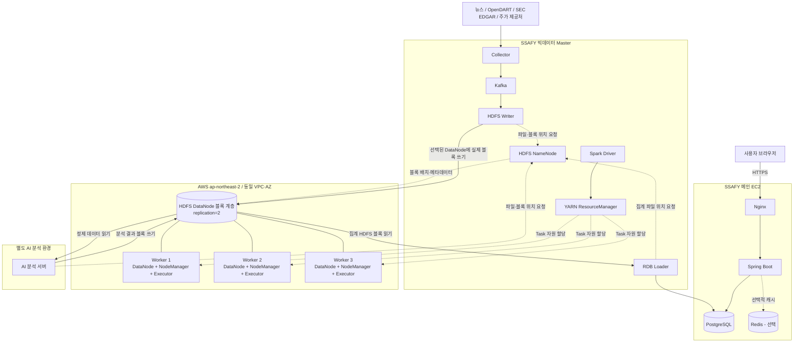

# COSMOS 분산 데이터 인프라 설계서

## 1. 문서 목적

이 문서는 COSMOS 서비스의 인프라 구현 담당자가 실제 서버를 구성할 수 있도록 물리 배치, 네트워크, Hadoop·Spark 역할, 데이터 흐름, 저장 정책과 운영 절차를 정의한다.

- 운영 종료 예정일: 2026-10-04
- 목표 누적 데이터: 약 2,000만 건
- Hadoop 구성: NameNode 1대, DataNode 3대
- HDFS 복제 계수: `2`
- 서비스 성격: 프로젝트 기간 동안 운영하는 단일 Master 기반 하이브리드 클러스터

이 문서는 다음 문서와 함께 사용한다.

- [`architecture.md`](./architecture.md): 서비스 논리 구조와 분석 모델
- [`database-design.md`](./database-design.md): PostgreSQL·HDFS·Redis 데이터 모델
- [`api-specification.md`](./api-specification.md): Spring Boot API 계약

문서 간 물리 배치나 런타임 구성이 충돌하면 이 문서를 인프라 구현 기준으로 사용한다. `architecture.md`의 FastAPI·Neo4j·Jena 구성은 논리 분석 모델 참고용이며, 현재 웹 서비스 배포 기준은 이 문서의 Spring Boot·PostgreSQL 구성이다.

비밀번호, AWS 키, SSH 개인키, Kafka 인증정보와 DB 접속정보는 이 문서와 Git 저장소에 기록하지 않는다.

## 2. 핵심 설계 원칙

1. HDFS는 원본·정제·분석·집계 데이터의 보존과 재처리를 담당한다.
2. PostgreSQL은 웹 API가 빠르게 조회할 정형 결과만 보관한다.
3. 실시간 수집 데이터는 Kafka를 통해 HDFS Writer로 전달한다.
4. 원본은 먼저 `raw`에 보존하고 정제·분석 결과를 별도 경로에 기록한다.
5. Spark Driver는 Master에 두고 실제 Task는 Worker의 Executor가 수행한다.
6. SSAFY 서버와 AWS 서버의 Hadoop 포트를 공용 인터넷에 공개하지 않는다.
7. 인스턴스 컴퓨팅 사양과 EBS 저장 용량을 독립적으로 관리한다.
8. 모든 시간은 내부적으로 UTC를 사용하고 화면에서 사용자 시간대로 변환한다.

## 3. 전체 인프라 구성



### 3.1 SSAFY 메인 EC2

| 구성요소 | 역할 |
| --- | --- |
| Nginx | TLS 종료, 정적 파일 제공, Spring Boot 리버스 프록시 |
| Spring Boot | 인증, 비즈니스 로직, 기업·뉴스·관계·지표 API |
| PostgreSQL | 기업 기준정보, 문서 메타데이터, 기간별 지표, 관계 기반 점수와 웹 조회 결과 |
| Redis | 공통 그래프 캐시와 Refresh Token 관리. 필요할 때만 사용 |

Spring Boot는 사용자 요청 처리 중 HDFS 원본을 직접 조회하거나 Spark Job을 실행하지 않는다.

### 3.2 SSAFY 빅데이터 Master

| 구성요소 | 역할 |
| --- | --- |
| NameNode | HDFS 디렉터리·파일·블록 ID·DataNode 위치 관리 |
| ResourceManager | YARN 클러스터 자원 할당과 애플리케이션 실행 관리 |
| Spark Driver | YARN `client` 배포 모드로 Master에서 실행하며 Job 계획 생성, Stage·Task 분할, Executor 조정 |
| Kafka | 실시간 수집 이벤트의 완충, 재처리 및 생산자·소비자 분리 |
| Collector | 외부 뉴스·공시·주가 데이터 수집 및 Kafka 발행 |
| HDFS Writer | Kafka Consumer로서 실시간 원본을 HDFS `raw`에 저장 |
| RDB Loader | 성공한 집계 결과를 PostgreSQL에 멱등 적재 |

NameNode는 실제 원문 블록을 저장하지 않는다. 실제 데이터는 AWS DataNode 3대의 EBS에 저장한다.

### 3.3 AWS Worker 1~3

각 Worker는 동일한 구성을 사용한다.

| 구성요소 | 역할 |
| --- | --- |
| DataNode | HDFS 블록과 체크섬 저장, 복제, block report·heartbeat 전송 |
| NodeManager | Worker CPU·메모리 관리, YARN 컨테이너 실행 |
| Spark Executor | 정제, 조인, 셔플, 기간 집계와 그래프 기반 점수 계산 |

세 Worker는 서울 리전의 동일 VPC와 가능하면 동일 가용 영역에 배치한다. Hadoop·YARN·Spark가 광고하고 사용하는 클러스터 호스트명은 모든 참여 노드에서 동일하게 해석되어야 한다. 본 설계에서는 주소 혼용을 피하기 위해 Tailscale IP 또는 MagicDNS 이름을 클러스터 공통 주소로 사용한다. 같은 AWS VPC의 Worker끼리는 Tailscale이 직접 연결을 형성하도록 하여 실제 패킷이 AWS 내부 경로를 사용하게 한다.

## 4. 네트워크 및 보안

### 4.1 권장 연결 방식

SSAFY와 AWS는 서로 다른 네트워크이므로 Tailscale을 핵심 인프라 5대에 설치해 하나의 암호화 사설망으로 연결하는 방식을 우선 적용한다. 별도 AI 분석 서버가 HDFS를 직접 읽고 쓴다면 해당 서버도 같은 사설망과 접근제어 대상에 포함한다.

```text
SSAFY 메인         Tailscale IP / MagicDNS
SSAFY Master       Tailscale IP / MagicDNS
AWS Worker 1       Tailscale IP / MagicDNS
AWS Worker 2       Tailscale IP / MagicDNS
AWS Worker 3       Tailscale IP / MagicDNS
AI 분석 서버       Tailscale IP / MagicDNS (HDFS 직접 접근 시)
```

- Hadoop 설정에는 변경 가능한 공인 IP를 넣지 않는다.
- Master와 Worker 간에는 Tailscale IP 또는 MagicDNS 이름을 사용한다.
- Hadoop·YARN·Spark 설정은 모든 노드가 접근 가능한 Tailscale IP 또는 MagicDNS 이름으로 통일한다.
- Worker끼리 Tailscale `direct` 연결을 사용하면 동일 VPC의 실제 전송 경로는 AWS 내부망을 사용한다.
- VPC 사설 IP와 Tailscale 주소를 혼용하려면 split-horizon DNS와 서비스별 광고 주소를 별도로 설계해야 하므로 기본안에서는 사용하지 않는다.
- `tailscale ping`과 `tailscale status`에서 Master↔Worker가 `direct`인지 확인한다.
- DERP relay만 사용하는 경우 대규모 HDFS 전송과 Spark 셔플 전에 네트워크를 개선한다.

Tailscale 사용이 허용되지 않으면 직접 구축한 WireGuard를 대안으로 사용한다. AWS Site-to-Site VPN은 SSAFY 측 게이트웨이 설정 권한과 추가 비용이 필요하므로 본 프로젝트의 기본안에서 제외한다.

### 4.2 방화벽 원칙

- HDFS, YARN, Spark, Kafka, PostgreSQL 포트를 `0.0.0.0/0`에 공개하지 않는다.
- AWS Security Group은 Worker 상호 간 사설 통신과 필요한 관리 접속만 허용한다.
- SSAFY UFW는 `tailscale0` 인터페이스에서 필요한 내부 통신만 허용한다.
- PostgreSQL은 RDB Loader와 Spring Boot의 사설 주소만 허용한다.
- Nginx의 `80/443`만 공개하고, 운영 시 `80`은 `443`으로 리다이렉트한다.
- SSH는 승인된 관리 IP 또는 Tailscale SSH만 허용한다.
- Spark의 동적 포트는 운영 전에 고정 범위로 지정하고 해당 범위만 사설망에 허용한다.

구체적인 포트는 설치한 Hadoop·Spark·Kafka 버전과 실제 설정 파일을 기준으로 확정한다. 기본 포트를 문서만 보고 무조건 공개하지 않는다.

### 4.3 자격 증명

- AWS 루트 Access Key를 운영 자동화에 사용하지 않는다.
- 최소 권한 IAM 사용자 또는 역할을 생성한다.
- AWS 자격 증명, PEM 키, DB 비밀번호, Kafka 비밀번호를 Git에 커밋하지 않는다.
- 서버에는 환경변수 파일 또는 별도 Secret 관리 방식을 사용하고 파일 권한을 제한한다.
- 프로젝트 종료 시 AWS 리소스, IAM 키, Tailscale 장치와 인증 키를 폐기한다.

## 5. HDFS 설계

### 5.1 논리 디렉터리

다음 트리는 클러스터 전체에 하나만 존재하는 HDFS 네임스페이스다. 각 Worker의 로컬 파일시스템에 동일한 폴더 트리를 만들지 않는다.

```text
/data-lake
├── raw
│   ├── news
│   │   └── ingestion_type=realtime
│   ├── disclosures
│   └── stocks
├── cleaned
│   ├── news
│   ├── disclosures
│   └── stocks
├── analyzed
│   ├── news
│   │   ├── company-mentions
│   │   ├── relationships
│   │   ├── sentiment
│   │   └── evidence
│   └── disclosures
│       ├── company-mentions
│       ├── relationships
│       └── evidence
├── features
│   ├── company
│   └── relationship
├── aggregated
│   ├── company-metrics
│   └── relationship-scores
├── snapshots
│   └── graph
└── quarantine
    ├── crawling-failures
    ├── invalid-schema
    └── analysis-failures
```

빈 디렉터리는 NameNode 메타데이터로 미리 생성할 수 있다. DataNode에는 HDFS 경로가 아닌 `블록 ID → 실제 바이트 데이터 및 체크섬`이 저장된다.

```text
NameNode
파일 경로 → 블록 ID 목록 → 블록을 보유한 DataNode 목록

DataNode
블록 ID → 실제 데이터 조각 + .meta 체크섬
```

### 5.2 블록과 복제

- 초기 HDFS 블록 크기: `128 MiB`
- 복제 계수: `2`
- 최종 파일 권장 크기: 약 `128~512 MiB`
- 작은 파일은 주기적으로 compaction한다.

복제 예시는 다음과 같지만 실제 배치는 NameNode가 용량, 노드 상태와 복제 위치를 고려해 결정한다.

```text
Block A → Worker 1, Worker 2
Block B → Worker 1, Worker 3
Block C → Worker 2, Worker 3
```

NameNode는 HDFS 디스크 상태를 기준으로 블록 위치를 선택한다. Spark CPU·메모리 작업 배치는 NameNode가 아닌 YARN ResourceManager가 담당한다.

### 5.3 파일·파티션 정책

- 문서 한 건당 파일 하나를 만들지 않는다.
- 원본은 여러 문서를 묶은 압축 JSONL 또는 보존 가능한 원문 형식으로 저장한다.
- 정제·분석·집계 데이터는 `Parquet + Snappy`를 기본으로 한다.
- 파티션 기준은 `dataset_type`, `ingestion_type`, 이벤트 날짜, 필요 시 출처를 사용한다.
- 조회 조건에 거의 사용하지 않는 고카디널리티 값을 파티션 키로 사용하지 않는다.

예시:

```text
/data-lake/raw/news/
  ingestion_type=realtime/
  event_date=2026-09-12/
  hour=13/
  part-00000.jsonl.gz

/data-lake/cleaned/news/
  event_date=2026-09-12/
  part-00000.parquet
```

### 5.4 NameNode 메타데이터 보호

- `fsimage`와 `edits` 저장 경로를 명시한다.
- NameNode 메타데이터를 주기적으로 SSAFY Master의 별도 디스크 또는 외부 백업 위치에 백업한다.
- 운영 종료 전 최종 HDFS 데이터와 NameNode 메타데이터의 보존 또는 폐기 여부를 결정한다.
- 본 구성은 SecondaryNameNode를 두더라도 자동 장애조치 HA가 아니다. NameNode는 단일 장애점이다.

## 6. Worker 컴퓨팅·스토리지 정책

### 6.1 초기 볼륨 구성

Worker 한 대당 다음과 같이 시작한다.

| 볼륨 | 초기 용량 | 용도 |
| --- | ---: | --- |
| Root gp3 | 30GB | Ubuntu, Java, Hadoop, Spark, 시스템 로그 |
| HDFS Data gp3 | 100GB | DataNode 블록 및 제한된 Spark 임시 공간 |

Worker 3대의 초기 HDFS 물리 용량은 300GB다. 복제 계수 `2`와 20% 운영 여유를 적용하면 안전한 논리 데이터 용량은 약 120GB이며, Spark 임시 공간을 같은 볼륨에서 사용하면 실사용 한도는 더 낮아진다.

초기 적재 대상의 실제 바이트 크기를 적재 전에 반드시 측정한다. 건수만으로 용량을 판단하지 않는다.

### 6.2 EBS 확장

- HDFS 사용률 55%부터 확장을 준비한다.
- HDFS 사용률 65%에서 세 Worker를 같은 크기로 확장한다.
- 75% 이상에서는 대형 Spark Job을 중단하고 확장을 우선한다.
- 권장 단계: `100GB → 200GB → 필요 시 300GB`
- gp3 EBS는 인스턴스를 실행한 상태에서도 확장할 수 있다.
- AWS에서 볼륨을 확장한 후 Linux 파티션과 파일시스템도 확장해야 한다.
- EBS는 직접 축소할 수 없다.
- 확장 후 `lsblk`, `df -h`, `hdfs dfsadmin -report`로 반영 여부를 확인한다.
- 불균형이 발생하면 HDFS Balancer를 실행한다.

### 6.3 인스턴스 유형 변경

인스턴스 유형은 저장 용량이 아니라 CPU·메모리 처리 능력을 조절한다. EBS와 HDFS 데이터는 유형 변경 후에도 유지된다.

| 작업 상태 | 권장 유형 |
| --- | --- |
| 최초 대량 적재·정제·집계 | `t3.large` |
| 실시간 수집과 소규모 정기 처리 | `t3.medium` |
| 대규모 재처리·전체 관계 집계 | `t3.large` |
| 연산이 거의 없는 대기 상태 | 비용 상황에 따라 `t3.small` |
| 수집·HDFS 접근도 없는 기간 | 인스턴스 중지 |

인스턴스 유형은 실행 중에 변경할 수 없다. Spark Job과 HDFS 쓰기를 멈춘 후 Worker를 한 대씩 중지하여 유형을 변경하고 재기동한다.

```text
Worker 1 작업 중지 → EC2 중지 → 유형 변경 → 시작 → DataNode/NodeManager 확인
Worker 2 작업 중지 → EC2 중지 → 유형 변경 → 시작 → DataNode/NodeManager 확인
Worker 3 작업 중지 → EC2 중지 → 유형 변경 → 시작 → DataNode/NodeManager 확인
```

- 공인 IP는 중지·시작 후 변경될 수 있으므로 Hadoop 설정에서 사용하지 않는다.
- T3 CPU credit mode는 예측하지 못한 Unlimited 추가 요금을 피하기 위해 `standard`를 우선 검토한다.
- 인스턴스를 중지해도 EBS 요금은 계속 발생한다.
- 현재 AWS Free Plan에서 `t3.medium` 또는 `t3.large` 변경이 제한되면 Paid Plan 전환이 필요할 수 있다. 전환 전에 남은 크레딧과 실제 결제 한도를 확인한다.

## 7. 전체 데이터 흐름

```mermaid
flowchart LR
    External[뉴스·공시·주가 원천]
    Collector[Collector]
    Kafka[Kafka]
    RealtimeWriter[HDFS Writer]
    Raw[(HDFS raw)]
    CleanJob[Spark 정제·정규화]
    Cleaned[(HDFS cleaned)]
    AI[AI 분석]
    Analyzed[(HDFS analyzed)]
    FeatureJob[Spark 특징·관계 기반 점수 계산]
    Features[(HDFS features)]
    Aggregate[Spark 7D·30D·90D 집계]
    Aggregated[(HDFS aggregated / snapshots)]
    Loader[RDB Loader]
    PG[(PostgreSQL)]
    API[Spring Boot]
    Web[웹 페이지]

    External --> Collector --> Kafka --> RealtimeWriter --> Raw
    Raw --> CleanJob --> Cleaned --> AI --> Analyzed
    Analyzed --> FeatureJob --> Features --> Aggregate --> Aggregated
    Aggregated --> Loader --> PG --> API --> Web
```



### 7.1 실시간·주기 수집

1. Collector가 외부 API 또는 크롤링 결과를 수신한다.
2. 출처, 외부 식별자, 수집 시각, 스키마 버전과 실행 ID를 추가한다.
3. Kafka의 데이터 유형별 Topic에 발행한다.
4. HDFS Writer가 Consumer Group으로 메시지를 읽는다.
5. 일정 크기·시간 단위로 묶어 `raw/realtime`에 저장한다.
6. HDFS 저장과 체크포인트 기록이 완료된 뒤 Kafka offset을 commit한다.
7. 최종 실패 건은 DLQ와 `quarantine`에 기록한다.

Kafka Topic 이름은 구현 전 확정하되 다음 구분을 권장한다.

```text
news.raw
disclosures.opendart.raw
disclosures.sec.raw
stocks.raw
pipeline.dlq
```

### 7.2 정제·정규화

Spark Job 코드는 Master에서 관리하고 YARN `client` 배포 모드로 제출한다. Driver는 Master에서 실행되고 실제 Task는 Worker 3대에서 실행된다. `cluster` 배포 모드를 사용하면 Driver 위치가 달라지므로 본 설계의 기본값으로 사용하지 않는다.

```text
Master의 Spark Driver
→ 입력 파티션 계획
→ YARN ResourceManager에 자원 요청
→ Worker NodeManager가 Executor 실행
→ Executor가 raw 파티션 처리
→ cleaned에 Parquet 결과 저장
```

주요 작업:

- URL·본문·날짜 형식 정규화
- 인코딩과 누락값 처리
- 중복 문서 판정
- 기업명 alias 및 종목·법인 코드 매핑
- 공통 `document_id` 확정
- 잘못된 스키마를 `quarantine/invalid-schema`로 분리

### 7.3 AI 분석

AI 분석 프로그램은 `cleaned` 데이터를 읽어 다음 결과를 생성한다.

- 기업 언급 및 관련도
- 뉴스 감성
- 기업 간 관계 유형과 신뢰도
- 대표 근거 문장
- 공시 기반 관계

AI 분석은 핵심 인프라 5대 산정에 포함되지 않는 별도의 AI 분석 서버에서 수행한다. AI 분석 서버가 HDFS `cleaned`를 직접 읽고 `analyzed`에 결과를 기록하려면 Hadoop 클라이언트 설정과 Tailscale 접근 권한을 제공한다. 직접 HDFS에 접근하지 않는 경우에는 Master의 중계 프로그램이 동일한 입출력 경로 계약을 지켜 데이터를 전달한다. Spark Worker는 AI 추론이 아니라 데이터 정제·조인·집계·셔플을 담당한다.

### 7.4 특징값과 기간 집계

Spark가 기업 쌍과 기간별로 다음 기반 값을 계산한다.

집계 기간은 `7D`, `30D`, `90D`를 사용하며 시스템 간 기준 시각과 저장 시각은 UTC로 통일한다.

```text
source_company_id
target_company_id
window_type: 7D | 30D | 90D
news_score
disclosure_score
score
evidence_count
confidence
measured_at
formula_version
```

- `news_score`와 `disclosure_score`는 동일한 점수 범위를 사용한다.
- `score`는 시스템 기본 비율인 뉴스 50%·공시 50%로 계산한 공통 관계 점수다.
- 해당 출처의 근거가 없으면 구성 점수는 `0`이 아닌 `NULL`로 기록한다.
- 뉴스와 공시 점수가 모두 있으면 지정 비율로 조합하고, 한쪽만 있으면 존재하는 점수를 그대로 사용한다.
- RDB Loader는 세 점수를 `RELATIONSHIP_SCORE_CURRENT`와 `RELATIONSHIP_SCORE_HISTORY`에 함께 적재한다.
- 사용자 가중치와 개인화 결과는 서버에 저장하지 않는다. 프론트엔드는 가중치를 브라우저 탭의 `sessionStorage`에 보관하고 구성 점수를 즉시 조합한다.

반복 작업의 핵심은 다음과 같다.

- 신규 데이터 증분 처리
- 이동하는 `7D·30D·90D` 기간 집계
- 기업 관계 그래프 및 스냅샷 갱신
- 늦게 도착한 데이터가 영향을 미치는 기간 재집계
- 작은 파일 compaction과 데이터 품질 검증
- 모델·기업 사전·계산식 변경 시 선택적 또는 전체 재처리

### 7.5 PostgreSQL 적재

Spark Task가 Worker에서 PostgreSQL에 직접 쓰지 않는다.

1. Spark Job이 HDFS `aggregated`에 결과를 기록한다.
2. Job 성공과 산출물 검증을 확인한다.
3. RDB Loader가 HDFS 결과를 읽는다.
4. Tailscale 사설 경로로 PostgreSQL에 연결한다.
5. 키와 계산 버전을 기준으로 staging table에 적재한다.
6. 검증 후 트랜잭션으로 UPSERT 또는 publish한다.
7. 성공한 `snapshot_id`만 API 조회 대상으로 전환한다.

이 절차는 일부 Executor 실패나 Job 재시도로 PostgreSQL에 불완전하거나 중복된 결과가 노출되는 것을 방지한다.

구현은 `AI/rdb_loader`에 있으며 [RDB Loader 실행·연결 가이드](rdb-loader.md)를 따른다.
완료 manifest와 파일별 SHA-256을 검증한 전체 스냅샷을 staging으로 복사하고,
`CURRENT` 교체·`HISTORY` 누적·적재 영수증·`PUBLISHED` 전환을 한 트랜잭션으로 처리한다.
Spring 그래프 조회는 `REPEATABLE READ`로 동일 요청 안에서 스냅샷과 점수의 시점을 맞춘다.

## 8. 모니터링

### 8.1 필수 확인 지표

| 영역 | 지표 |
| --- | --- |
| HDFS | live/dead DataNode, 사용률, under-replicated/missing block |
| YARN | live NodeManager, pending/running container, memory·vCore 사용량 |
| Spark | Job/Stage/Task 시간, 실패·재시도, shuffle read/write, spill, skew |
| Kafka | broker 상태, topic partition, consumer lag, DLQ 증가량 |
| PostgreSQL | 연결 수, slow query, 디스크, 적재 실패와 최신 snapshot |
| 네트워크 | Tailscale direct/relay 여부, RTT, 패킷 손실, AWS outbound 전송량 |
| AWS 비용 | 남은 크레딧, EC2 시간, EBS 용량, IPv4, CPU credit 과금 |

## 9. 최종 구조 요약

```text
외부 데이터
→ Collector
→ Kafka
→ HDFS raw 분산 저장, replication=2
→ Spark 증분 정제·정규화
→ AI 분석
→ Spark 기반 점수 및 7D·30D·90D 관계 집계
→ HDFS aggregated/snapshots
→ RDB Loader
→ PostgreSQL
→ Spring Boot API 조회
→ Nginx
→ 웹 페이지
```

이 구조에서 HDFS와 Spark는 원본 보존, 증분 처리, 이동 기간 집계, 그래프 갱신 및 재처리를 담당한다. PostgreSQL과 Spring Boot는 사전 계산된 결과를 빠르게 조회하는 서비스 계층을 담당한다.
